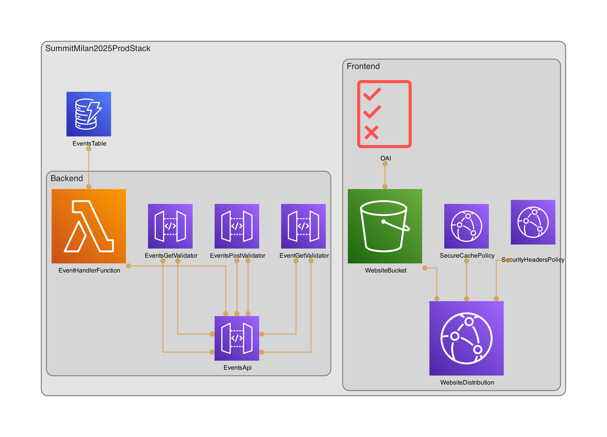

# IaC: From Keyboard to Cloud - Summit Milan 2025

Questo repository contiene il codice di esempio per il talk "IaC: From Keyboard to Cloud" presentato al Summit Milan 2025.

## 🚀 Architettura

Il progetto implementa un'architettura serverless moderna che include:

- **Frontend**: hosting statico su S3 con distribuzione CloudFront
- **Backend**: API RESTful con API Gateway e Lambda
- **Database**: DynamoDB con configurazione ottimizzata
- **Sicurezza**: IAM con privilegi minimi e configurazioni di sicurezza

```
┌───────────────────────────────────────────────────────────────────────────┐
│                                                                           │
│                             CLIENT                                        │
│                                                                           │
└───────────────┬───────────────────────────────────────────┬───────────────┘
                │                                           │
                ▼                                           ▼
┌───────────────────────────┐                 ┌─────────────────────────────┐
│                           │                 │                             │
│    CloudFront             │                 │      API Gateway            │
│    Distribution           │                 │      (REST API)             │
│                           │                 │                             │
└───────────────┬───────────┘                 └────────────┬────────────────┘
                │                                          │
                ▼                                          ▼
┌───────────────────────────┐                 ┌─────────────────────────────┐
│                           │                 │                             │
│    S3 Bucket              │                 │  Lambda Functions           │
│    (Static Website)       │                 │  (Event Handler)            │
│                           │                 │                             │
└───────────────────────────┘                 └────────────┬────────────────┘
                                                           │
                                                           ▼
                                              ┌─────────────────────────────┐
                                              │                             │
                                              │  DynamoDB Table             │
                                              │  (Events Data)              │
                                              │                             │
                                              └─────────────────────────────┘
```



### Flusso dei dati:

1. **Accesso utente**:
   - Gli utenti accedono al frontend statico tramite CloudFront che distribuisce i contenuti dal bucket S3
   - Le API sono esposte tramite API Gateway

2. **Operazioni di dati**:
   - Le richieste API vengono instradate alla funzione Lambda appropriata
   - La funzione Lambda esegue operazioni CRUD sulla tabella DynamoDB
   - I risultati vengono restituiti all'utente attraverso l'API Gateway

3. **Sicurezza**:
   - OAI (Origin Access Identity) protegge l'accesso diretto al bucket S3
   - Le policy IAM seguono il principio del privilegio minimo
   - Tutto il traffico è criptato con TLS

## 📋 Best Practice IaC Dimostrate

### 1. Auto-documentazione del codice

- **JSDoc/TSDoc**: Documentazione completa per tutti i costrutti
- **Tag semantici**: Ogni risorsa include tag che descrivono scopo, ambiente e responsabilità
- **CloudFormation Outputs**: Esportazione esplicita degli endpoint e dei nomi delle risorse
- **Commenti informativi**: Spiegazioni sulle decisioni di progettazione e sui pattern utilizzati
- **Documentazione automatica**: Generazione di documentazione in formato Markdown direttamente dai costrutti
- **Tag semantici avanzati**: Informazioni di business, criticità e metadati nei tag delle risorse
- **Controlli di qualità documentale**: Aspect per verificare la presenza di tag repertori di documentazione appropriati

### 2. Struttura del codice

- **Costrutti personalizzati**: Utilizzo di costrutti CDK personalizzati per ogni componente
- **Separazione degli strati**: Database, backend e frontend chiaramente separati
- **Stack per ambiente**: Stack dedicati per ogni ambiente (dev, prod)
- **Naming consistente**: Convenzioni di denominazione coerenti con prefissi/suffissi espliciti
- **Organizzazione modulare**: Ogni componente infrastrutturale è isolato e ben definito

#### Struttura del progetto

```
summit-milan-2025/
├── src/                          # Codice sorgente dell'applicazione
│   ├── lambda/                   # Funzioni Lambda
│   │   └── event-handler/        
│   │       └── index.js          
│   └── frontend/                 # Codice frontend (se presente)
│
├── infra/                        # Codice infrastruttura
│   ├── lib/                      # Librerie e costrutti riutilizzabili
│   │   ├── aspects/              # Aspects CDK
│   │   │   └── documentation-aspect.ts
│   │   └── constructs/           # Costrutti CDK personalizzati
│   │       ├── database/         # Costrutti per il layer database
│   │       │   └── database-construct.ts
│   │       ├── backend/          # Costrutti per il layer backend
│   │       │   └── backend-construct.ts
│   │       ├── frontend/         # Costrutti per il layer frontend
│   │       │   └── frontend-construct.ts
│   │       └── common/           # Costrutti comuni riutilizzabili
│   │           └── documented-bucket.ts
│   │
│   ├── stacks/                   # Definizioni degli stack
│   │   ├── development-stack.ts  # Stack per ambiente di sviluppo
│   │   ├── production-stack.ts   # Stack per ambiente di produzione
│   │   └── summit-milan-2025-stack.ts # Stack originale (mantenuto per riferimento)
│   │
│   └── bin/                      # Entry point CDK
│       └── app.ts                # Applicazione CDK principale
│
├── test/                         # Test unitari e di integrazione
│   ├── unit/                     # Test unitari
│   │   ├── constructs/           # Test dei costrutti
│   │   └── stacks/               # Test degli stack
│   └── integration/              # Test di integrazione
│
├── docs/                         # Documentazione del progetto
│
├── cdk.json                      # Configurazione CDK
├── package.json
├── tsconfig.json
└── README.md
```

### 3. Gestione degli ambienti

- **Configurazione condizionale**: Comportamento diverso in base all'ambiente (dev/prod)
- **Policy di rimozione sicure**: Protezione contro la cancellazione accidentale in produzione
- **Variabili d'ambiente**: Configurazione esternalizzata per gli ambienti di runtime
- **Ottimizzazioni per sviluppo**: Logging verboso, tracing e auto-cancellazione risorse
- **Configurazioni di produzione**: Resilienza, backup automatici e protezione risorse

### 4. Sicurezza

- **Principio del privilegio minimo**: IAM policies specifiche per funzione
- **Encryption at rest**: Dati criptati per impostazione predefinita
- **TLS enforcement**: HTTPS obbligatorio su tutte le comunicazioni
- **Segregazione degli accessi**: Limitazione dell'accesso alle risorse tramite OAI

### 5. Osservabilità

- **Logging abilitato**: Configurazione di logging per tutti i servizi
- **X-Ray tracing**: Analisi delle performance end-to-end
- **Tagging per costi**: Monitoraggio dei costi per componente e ambiente

## 🔄 Rifattorizzazione e Evoluzione

Il progetto è stato sviluppato seguendo un percorso evolutivo tipico:

1. **Versione iniziale**: Stack monolitico con tutte le risorse definite insieme
2. **Modularizzazione**: Suddivisione in costrutti specifici per database, backend e frontend
3. **Ottimizzazione per ambiente**: Stack separati con configurazioni specifiche per dev e prod
4. **Auto-documentazione avanzata**: Implementazione di meccanismi avanzati di documentazione
5. **Riorganizzazione del progetto**: Struttura ottimizzata con separazione tra codice applicativo e infrastrutturale

### Costrutti speciali

- **DocumentationAspect**: Verifica che le risorse abbiano tag repertori di documentazione appropriati in fase di sintesi
- **DocumentedBucket**: Costrutto S3 avanzato che genera automaticamente documentazione in formato Markdown e applica tag semantici
- **ComplianceAspect**: Verifica la conformità dell'infrastruttura alle best practice AWS tramite cdk-nag

## 🔄 Generazione automatica di diagrammi

Questo progetto include un sistema di generazione automatica di diagrammi dell'architettura utilizzando **cdk-dia**. I diagrammi vengono generati direttamente dal codice CDK, garantendo che siano sempre allineati con l'architettura effettivamente implementata.

### Caratteristiche

- **Aggiornamento automatico**: I diagrammi si aggiornano automaticamente quando cambia l'infrastruttura
- **Rappresentazione visiva**: Visualizzazione chiara delle relazioni tra le risorse
- **Formato misto**: Generazione sia in formato PNG che in formato DOT (personalizzabile)
- **Supporto multi-ambiente**: Diagrammi specifici per ambiente di sviluppo e produzione

### Come generare i diagrammi

```bash
# Genera tutti i diagrammi dell'architettura
npm run diagrams

# I diagrammi verranno salvati in docs/diagrams/
```

> I diagrammi vengono generati automaticamente quando esegui lo script. Dopo la generazione, un'immagine del tipo `dev-architecture.png` sarà disponibile nella cartella dei diagrammi.
>
> **Nota**: Per generare i diagrammi PNG è necessario installare Graphviz:
> ```bash
> # Su macOS con Homebrew
> brew install graphviz
> 
> # Su Ubuntu/Debian
> apt-get install graphviz
> 
> # Su Windows con Chocolatey
> choco install graphviz
> ```

## 🔐 CDK Nag per la documentazione della conformità

Il progetto utilizza **cdk-nag** per verificare automaticamente la conformità dell'infrastruttura alle best practice di AWS e agli standard di sicurezza. Questo genera automaticamente documentazione sul livello di conformità.

### Caratteristiche

- **Verifica automatica**: Controlla l'aderenza alle best practice durante la sintesi
- **Report di conformità**: Genera report dettagliati in formato Markdown
- **Categorizzazione dei problemi**: Organizza i risultati per tipologia 
- **Configurabile**: Possibilità di sopprimere controlli specifici con motivazioni
- **Integrato nel workflow**: Parte integrante del processo di sviluppo

### Come generare i report di conformità

```bash
# Genera report di conformità per tutti gli ambienti
npm run compliance

# Oppure genera tutta la documentazione (diagrammi + conformità)
npm run docs

# I report verranno salvati in docs/compliance/
```

### Esempio di report

I report generati includono:

- Riepilogo del numero totale di problemi di conformità
- Dettaglio di ciascun problema con riferimento alla risorsa specifica
- Categorie di problemi (AWS Solutions, Sicurezza, ecc.)
- Guida all'interpretazione dei risultati

### Integrazione nel workflow

L'aspetto di conformità è integrato direttamente nell'applicazione CDK:

```typescript
// Aggiungi l'aspect di compliance allo stack
new ComplianceAspect(stack, 'ComplianceChecks', {
  // In produzione, siamo più rigorosi con i controlli di conformità
  strict: targetEnvironment === 'prod',
  suppressions: [
    { id: 'AwsSolutions-S1', reason: 'Accessi dei server log gestiti da policy IAM' }
  ]
});
```

## 🛠️ Getting Started

### Prerequisiti

- Node.js 16+
- AWS CLI configurato
- Account AWS con i permessi necessari

### Installazione

```bash
# Installa le dipendenze
npm install

# Bootstrap dell'ambiente CDK (se non già fatto)
npx cdk bootstrap
```

### Deployment

Il progetto è configurato per supportare diversi ambienti attraverso stack dedicati:

```bash
# Deploy ambiente di sviluppo (default)
npx cdk deploy SummitMilan2025DevStack

# Deploy ambiente di produzione
npx cdk deploy SummitMilan2025ProdStack --context environment=prod
```

### Comandi utili

```bash
# Visualizza le differenze prima del deployment
npx cdk diff SummitMilan2025DevStack
npx cdk diff SummitMilan2025ProdStack --context environment=prod

# Genera il template CloudFormation
npx cdk synth --context environment=dev
npx cdk synth --context environment=prod

# Visualizza gli stack disponibili
npx cdk ls
```

### Vantaggi dell'architettura modulare

L'utilizzo di costrutti personalizzati e stack separati offre numerosi vantaggi:

1. **Riusabilità**: I costrutti possono essere riutilizzati in diversi progetti
2. **Manutenibilità**: Ogni componente è isolato e può essere modificato indipendentemente
3. **Testabilità**: Ogni costrutto può essere testato in modo isolato
4. **Configurabilità**: Ogni ambiente ha il proprio stack con configurazioni specifiche
5. **Chiarezza**: La struttura del codice riflette l'architettura dell'applicazione

## 📚 Risorse IaC & CDK

### AWS CDK Best Practices

- [AWS CDK Best Practices](https://docs.aws.amazon.com/cdk/latest/guide/best-practices.html)
- [AWS Well-Architected Framework](https://aws.amazon.com/architecture/well-architected/)
- [CDK Patterns](https://cdkpatterns.com/)

### Libri consigliati

- "Infrastructure as Code" di Kief Morris
- "AWS CDK in Practice" di Mathew Bonig
- "Cloud Development Kit for Terraform" di HashiCorp

## 📝 Note

Questo progetto è progettato per scopi didattici e dimostra pattern e pratiche di IaC. Non è inteso per l'uso in produzione senza ulteriori personalizzazioni e revisioni di sicurezza.

---

Creato con ❤️ per il Summit Milan 2025
